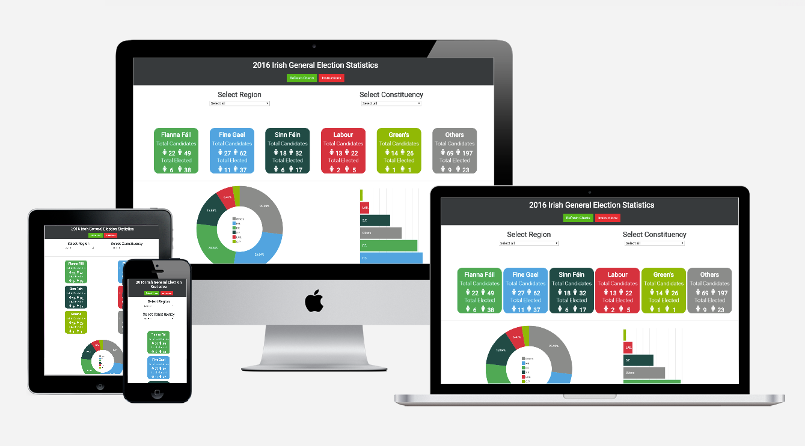

# Paul Dardis – BT Ireland

## Interactive Frontend Development Milestone Project

### Demo
A live demo can be found here https://pauldardis.github.io/milestone-project-2/

 

### Purpose

The 2016 Irish general election took place on Friday 26 February to elect 157 Teachtaí Dála (TDs) across 40 constituencies to Dáil Éireann 

Following the election, Fine Gael with 50 of the 158 seats available remained the largest party in the Dáil despite having lost 26 seats. The main opposition party Fianna Fáil, which had suffered its worst-ever election result of 20 seats in 2011, increased its seats to 44. Sinn Féin was expected to make gains, encouraged by opinion polls placing it ahead of Fianna Fáil, and it became the third-most numerous party with 23 deputies. The Labour Party, which had been the junior party in coalition government with Fine Gael and which had returned its best-ever showing of 37 seats in 2011, fell to just seven deputies, its lowest-ever share of Dáil seats. Smaller parties and independent politicians made up the remaining 34 seats

Following the introduction of gender quotas, a record 35 seats were filled by women, bringing the proportion of women in the Dáil to 22 percent, up from 15 percent after the previous general election.

This dashboard website has been built to show the breakdown of seats by party and also by gender, 

## UX

### Website Requirements
#### High Level Requirements
1.	Provide users with a percentage breakdown of 1st preference votes per party.
2.	Provide users with a breakdown of seats per party.
3.	Provide users with  gender breakdown of candidates per party  
4.	Provide users with a summarised list of all candidates 
5.	Provide users with a list of voter turnout by constituency. 
6.	Provide a help function to explain the data being displayed.

#### User Stories 
| No | User      | What I want to do         |
| -- |:---------:| :-----------------        |
| 1  |Public     |I want to be able to view the percentage of 1s preference votes by party for both region and constituency.|
| 2  |Public     |I want to be able to view the amount of seats won by party for both region and constituency. |
| 3  |Public     |I want to be able the view the gender breakdown by party and display as total candidates vs elected candidates.|
| 4  |Public     |I want to be able to get a summarised list which shows all the candidates by region and also by constituency |
| 5  |Public     |I want to view the percentage of total turnout by constituency.|
| 6  |Public     |I want to be able to view the amount of spoilt votes by constituency.|

#### Features
##### Dropdown Filter Box

Allows the user to either filter by region or a single constituency.

The regions have been broken down into the following

| Region     | Constituency      |
| --         |:---------|
| Connacht   |Galway East, Galway West, Mayo, Roscommon Galway, Sligo Leitrim.    |
| Dublin     |Dublin Bay North, Dublin Bay South, Dublin Central, Dublin Fingal, Dublin Mid West, Dublin North West, Dublin Rathdown, Dublin South Central, Dublin South West,  Dublin West, Dún Laoghaire     |
| Leinster   |Carlow Kilkenny, Kildare North, Kildare South, Laois, Longford Westmeath, Louth, Meath East, Meath West, Offaly, Wexford, Wicklow    |
| Munster    |Clare, Cork East, Cork North Central, Cork North West, Cork South Central, Cork South West, Kerry, Limerick City, Limerick County, Tipperary, Waterford    |
| Ulster     |Cavan Monaghan, Donegal   |

##### Party Breakdown 
There are 5 main parties in Ireland

* Fine Gael 
* Fianna Fáil
* Sinn Féin
* Labour
* Green Party
* Others

The smaller parties and independent candidates have been grouped together under “Other”

##### Party Colours
* Fine Gael  = #00A3DF 
* Fianna Fáil = #12A853
* Sinn Féin = #014B45
* Labour = #D6323D
* Green Party = #91B905
* Others = #8B8C8A

##### Party breakdown by Gender
This provides a count of candidates put forward by gender. It also proved a count on the successful elected candidates by gender 

##### First Preference Votes
This graph provide the percentage breakdown by party for their first preference votes 

##### Total seats won. 
This provides a breakdown on the amount of seats won by each party. 

##### Candidate data table
This provides summary data list on each candidate 
* Region 
* Constituency	
* Candidate Name	
* Gender	
* Party	
* Result	
* Votes Count 1	
* Final vote count

The list is displayed with 7 rows per page. Extra pages can be viewed by clicking on the Next button at the bottom of the table. 

##### Constituency Data Table
This provides summary data on each constituency.
* Total Electorate	
* Turnout Percentage	
* Valid Votes	
* Spoiled Votes

User can click on the headings to sort the data 

##### Refresh Button:
This removes all filters and refreshes the graphs and tables back to normal.

## Technologies used
### Programming languages
* HTML 
* CSS 
* JavaScript 

### Libraries
* Crossfilter 
* DC.JS
* D3.JS
* Queue.js
* JQuery
* Font Awesome 
* Google Fonts
* Bootstrap

### Testing 
#### HTML 
code was tested using https://validator.w3.org/ 
##### Results 
******************** need to put somthing in here ********************

### CSS 
code was tested using https://jigsaw.w3.org/css-validator/
#### Results 
******************** need to put somthing in here ********************

### Charts
******************** need to put somthing in here ********************

#### Issues found: 

CSV file had Irish names some of which contained a “fatha” this resulted in the name being displayed incorrectly in the graph and table. 
Example 
Dún Laoghaire displayed as D�n Laoghaire 

## Deployment
### Deployment
To deploy this project to GitHub Pages from its https://github.com/pauldardis/milestone-project-2, the following steps were taken:
1.	Log into GitHub.
2.	From the list of repositories on the screen, select **pauldardis/milestone-project-2**
3.	From the menu items near the top of the page, **select Settings**.
4.	Scroll down to the **GitHub Pages** section.
5.	Under Source click the drop-down menu labelled **None** and select **Master Branch**
6.	On selecting Master Branch the page is automatically refreshed, the project is now deployed.
7.	Scroll back down to the **GitHub Pages** section to retrieve the link to the deployed website.

### How to run this project locally
To clone this project from GitHub:
1. Follow this link to the https://github.com/pauldardis/milestone-project-2
2. Under the repository name, click "Clone or download".
3. In the Clone with HTTPs section, copy the clone URL for the repository.
4. In your local IDE open Git Bash.
5.  Change the current working directory to the location where you want the cloned directory to be made.
6.  Type git clone, and then paste the URL you copied in Step 3.
  

    git clone https://github.com/USERNAME/REPOSITORY
    
7. Press Enter. Your local clone will be created.

Further reading and troubleshooting on cloning a repository from GitHub https://help.github.com/en/articles/cloning-a-repository

## Credits
### Data Source
?????????
### Code Snippets
??????? 
### Help
???

## Disclaimer:
This project was created for educational use.

